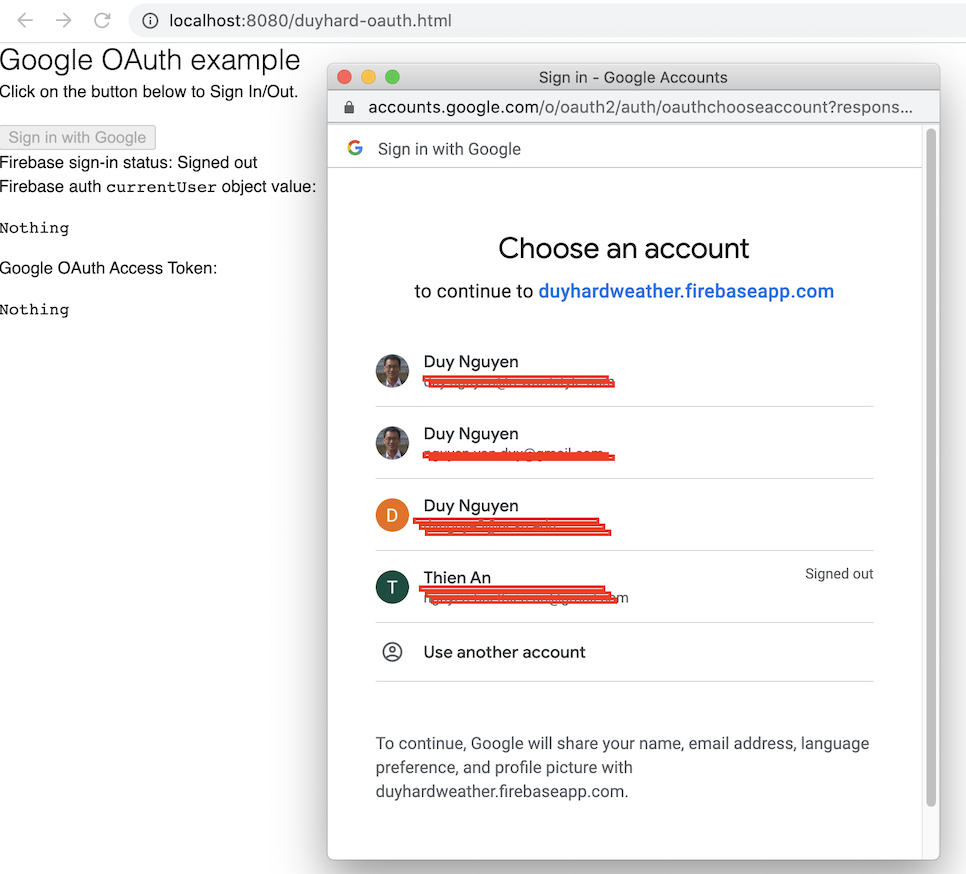

# Quick guide to use Google OAuth, just by JavaScript and HTML

## Pre-requisites

- node.js
- Google account
- Github account / git client

## Register an application on Firebase

Follow this link to create a web application, enable `Google Auth`: type https://console.firebase.google.com/

At the last step, copy and save the configuration somewhere. Something like this:

```javascript
<!-- The core Firebase JS SDK is always required and must be listed first -->
<script src="https://www.gstatic.com/firebasejs/7.22.0/firebase-app.js"></script>

<!-- TODO: Add SDKs for Firebase products that you want to use
     https://firebase.google.com/docs/web/setup#available-libraries -->

<script>
  // Your web app's Firebase configuration
  var firebaseConfig = {
    apiKey: "-GNYxyymxZYPi0c8",
    authDomain: "duyhardweather.firebaseapp.com",
    databaseURL: "https://duyhardweather.firebaseio.com",
    projectId: "duyhardweather",
    storageBucket: "duyhardweather.appspot.com",
    messagingSenderId: "491xxxx8",
    appId: "1:xxxx:web:xxxx"
  };
  // Initialize Firebase
  firebase.initializeApp(firebaseConfig);
</script>
```

## Run the code

```bash
$ git clone
$ cd duyhard-oauth
$ npm install
$ npm start
$ Server running on 8080...
```

Now you can access the app from your browser: 

http://localhost:8080/duyhard-oauth.html

Click on the `Sign in with Google` button, and Login with your Google credentials. You can `Sign out/in` multiple times.


