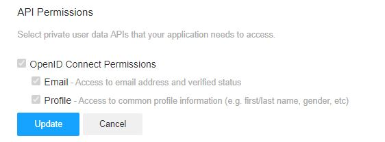

# Quick guide to use Google OAuth, just by JavaScript and HTML

## Pre-requisites

- Cordova
- Google account
- Github account / git client
- Yahoo Developer Account

## Register an application on Firebase

Follow this link to create a web application, enable `Yahoo Authentication`: type https://console.firebase.google.com/

At the last step, copy and save the configuration somewhere.
This will be the contents of your /js/firebase_creds.js it will look something like this :

```
  // Your web app's Firebase configuration
  var firebaseConfig = {
    apiKey: "-GNYxyymxZYPi0c8",
    authDomain: "duyhardweather.firebaseapp.com",
    databaseURL: "https://duyhardweather.firebaseio.com",
    projectId: "duyhardweather",
    storageBucket: "duyhardweather.appspot.com",
    messagingSenderId: "491xxxx8",
    appId: "1:xxxx:web:xxxx"
  };
  // Initialize Firebase
  firebase.initializeApp(firebaseConfig);

```

## Create a Yahoo developer account, create an application 

1. Visit https://developer.yahoo.com/apps/
2. Create an application
3. For redirect url use the URL from the yahoo authentication in your firebase console. It will look something like this  
  

4. Give the app the following permission   
  

5. Take your client ID and Client Secret and enter them into your firebase application under Authenticaion->Yahoo  

## Run the code


```bash
$ cordova create myProj
$ cd myProj
$ cordova platform add browser
```
Now replace the contents of the myProj/www folder with the contents provided here


Click on the `Sign in with Yahoo` button, and Login with your Yahoo credentials. You can `Sign out/in` multiple times.


